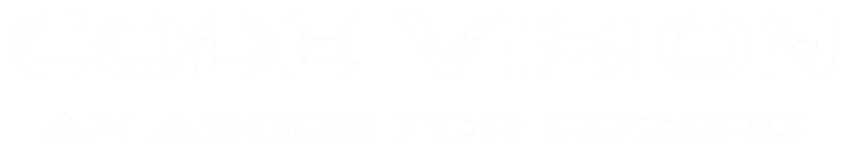

| [Home](./README.md) | [About Us](AboutUs.md) | [Events](Events.md) | [Members](Members.md) | [Alumni](Alumni.md) | [Gallery](Gallery.md) | [Contact Us](ContactUs.md) |
|------------------------|------------------------|---------------------|-----------------------|---------------------|-----------------------|----------------------------|

  
   
<i>To promote coders enriched with diverse technical skills.</i>
  
✨ <b>Join CV to enhance your CV.</b> ✨

---

## 🎥 Orientation
Welcome to **CODE VISION**!  
Our orientation program is designed to introduce you to the club, its members, and the various activities we offer.  

👉 Join us to learn more about our **mission, vision, and upcoming events.**  
### ▶️ Watch Orientation Video

---
# 🎉 Upcoming Event

<table>
  <tr>
    <td width="50%">
      <!-- Poster Image -->
      
    </td>
    <td width="50%" valign="top">
      <!-- Event Details -->
      <!-- <h2></h2> -->
      <h1>🏆 CODEJAM 2025</h1>
      
<em>A hackathon with the theme <strong>“Tech for Good”</strong>, encouraging teams to create impactful solutions to real-world problems.</em>

      <h4>📌 Details:</h4>
      <ul>
        <li><strong>Date:</strong> 8th & 9th September 2025</li>
        <li><strong>Format:</strong> Teams of 4 members compete</li>
        <li><strong>Focus:</strong> Solve real-world problems using coding and logic.</li>
        <li><strong>Activities:</strong> Mentorship, Demo Submissions, Networking</li>
        <li><strong>Rewards:</strong> 🥇 Trophies | 🏅 Badges </li>
        <li>Open to <strong>all years</strong> everyone can participate</li>
      </ul>
      

        
      

    </td>
  </tr>
</table>

<!-- ---

## 🏆 Our Achievements
- 👥 **195+ Active Members**  
- 🎪 **28+ Total Events**  
- 🎓 **3,500+ Participants**  
- 🌍 **1,363+ Site Visits**  

--- -->

## 🌟 Why Join CODE VISION?
✅ Gain Knowledge & Learn New Skills  
✅ Build Leadership & Communication Skills  
✅ Enhance Your Coding Skills  
✅ Network with Peers & Mentors  

---

## 📚 Explore More
- [About Us](AboutUs.md)  
- [Events](Events.md)  
- [Members](Members.md)  
- [Alumni](Alumni.md)  
- [Gallery](Gallery.md)  
- [Contact Us](ContactUs.md)  

---

## 📬 Contact Us
📧 Email: [codevisionafc@gmail.com](mailto:codevisionafc@gmail.com)  
📞 Phone: +91 6299059583 (SCO)  

🏛️ Address:  
1st floor, Dept. of CSE, Computer Science and Engineering Block,  
Bengal College of Engineering and Technology, Durgapur, West Bengal - 713212  

---

## 🌐 Follow Us
[GitHub](https://github.com/) | [LinkedIn](https://linkedin.com/) | [Instagram](https://instagram.com/) | [Facebook](https://facebook.com/) | [YouTube](https://youtube.com/)  

---

© 2025 **Code Vision**. All Rights Reserved.  

