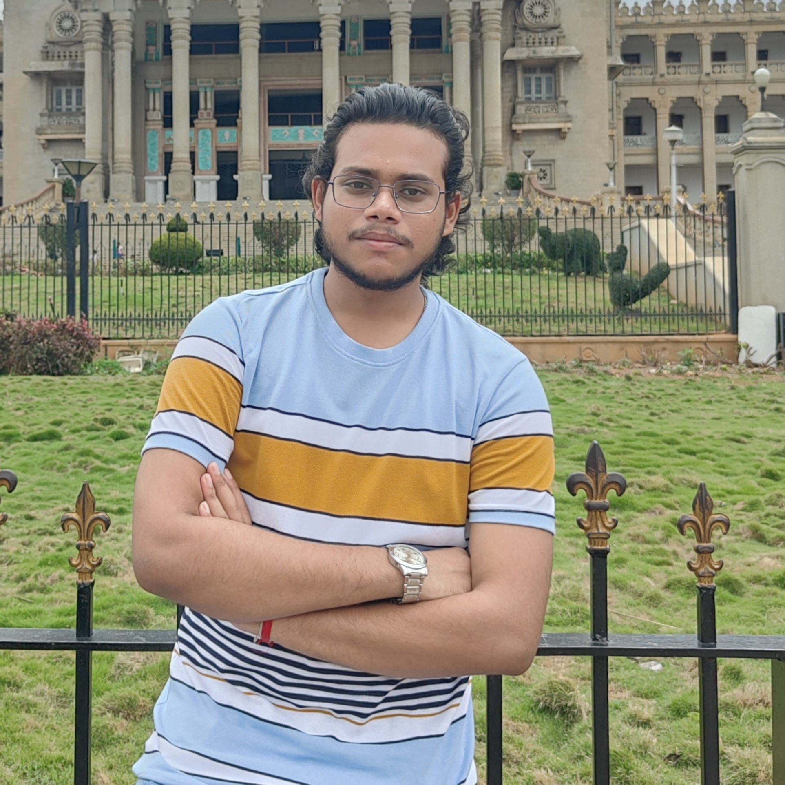

<!-- | [Home](./README.md) | [About Us](AboutUs.md) | [Events](Events.md) | [Members](Members.md) | [Alumni](Alumni.md) | [Gallery](Gallery.md) | [Contact Us](ContactUs.md) |
|------------------------|------------------------|---------------------|-----------------------|---------------------|-----------------------|----------------------------| -->

  
  
  
  
  
  
  

# 
About Us

 
Learn about our journey and mission
  

---

## 
Leadership
  

<table align="center">
  <tr>
    <td align="center">
       
      <b>S.K. Abdul Rahim</b> (H.O.D CSE) <i>President</i>
    </td>
    <td align="center">
       
      <b>Shiv Prasad Sir</b> (Faculty IT) <i>Vice President</i>
    </td>
    <td align="center">
       
      <b>Prasanna Roy Sir</b> (Faculty CSE) <i>Convenor</i>
    </td>
  </tr>
  <tr>
    <td align="center">
       
      <b>Sanjeevan Nag</b> (IT) <i>SCO</i>
    </td>
    <td align="center">
       
      <b>Mayank Rana</b> (CSE) <i>Joint SCO</i>
    </td>
    <td align="center">
       
      <b>Priyabrata Dey</b> (IT) <i>Joint SCO</i>
    </td>
  </tr>
</table>

---

## Club Details  

## 
Founders
  

### 
Teacher Founder :
  

   
  <b>Prasanjit Maji</b> <i>Teacher Founder</i>

### 
Student Founders :
  

<table align="center">
  <tr>
    <td align="center">
       
      <b>Hari Om</b>
    </td>
    <td align="center">
       
      <b>Shuvajit Dey</b>
    </td>
    <td align="center">
       
      <b>Aadarsh Choudhary</b>
    </td>
  </tr>
  <tr>
    <td align="center">
       
      <b>Rakesh Singh</b>
    </td>
    <td align="center">
       
      <b>Anurag Anand</b>
    </td>
  </tr>
</table>

- **Roles:**  
  - Final Year: Governors  
  - 3rd Year: Organizers  
  - 2nd Year: Coordinators  

- **Club Events:**  
  - Python Workshop (for 1st and 2nd Year)  
  - C-Workshop (for 1st Year)  
  - Console (Annual Event)  
  - CodeJam (Hackathon)  

---

## Our Story  

**CODE VISION** is a dynamic coding club dedicated to fostering technical excellence and leadership skills among students. We believe in *learning by doing* and creating opportunities for growth.  

Founded in **2016** by passionate individuals — **Rakesh Singh, Aadarsh Choudhary, Shuvajit Dey, Anurag Anand, and Hari Om** — the club was built to create a vibrant community of coders and tech enthusiasts.  

At Code Vision, we believe that coding is not just about writing lines of code; it’s about solving problems, innovating solutions, and continuously evolving in the fast-paced world of technology.  

We host:  
- **Coding Competitions**  
- **Hackathons**  
- **Workshops**  
- **Seminars**  

covering topics like debugging techniques, algorithm design, and problem-solving strategies. These events encourage collaboration and provide real-world technical exposure.  

Our goal is to equip members with **skills and connections** to succeed academically and professionally.  

---

## Vision  

✨ *An Abode for Coders*  
📌 *To promote coders enriched with diverse technical skills*  
💡 *Join CV to enhance your CV*  

---

## 📚 Explore More
- [Home](../README.md)  
- [About Us](../pages/ABOUT.md)  
- [Events](Events.md)  
- [Members](Members.md)  
- [Alumni](Alumni.md)  
- [Gallery](Gallery.md)  
- [Contact Us](ContactUs.md)  

---

## 📬 Contact Us
📧 Email: [codevisionafc@gmail.com](mailto:codevisionafc@gmail.com)  
📞 Phone: +91 6299059583 (SCO)  

🏛️ Address:  
1st floor, Dept. of CSE, Computer Science and Engineering Block,  
Bengal College of Engineering and Technology, Durgapur, West Bengal - 713212  

---

## 🌐 Follow Us

[Website]( https://codevision-bcet.web.app/) |[GitHub](https://github.com/Code-Vision-BCET-organisation ) | [LinkedIn](https://www.linkedin.com/company/codevision-bcet) | [Instagram](https://www.instagram.com/codevisionbcet/) | [Facebook](https://www.facebook.com/cv.bcet/) | [YouTube](http://www.youtube.com/@codevisionbcet )  

---

© 2025 **Code Vision**. All Rights Reserved.  

