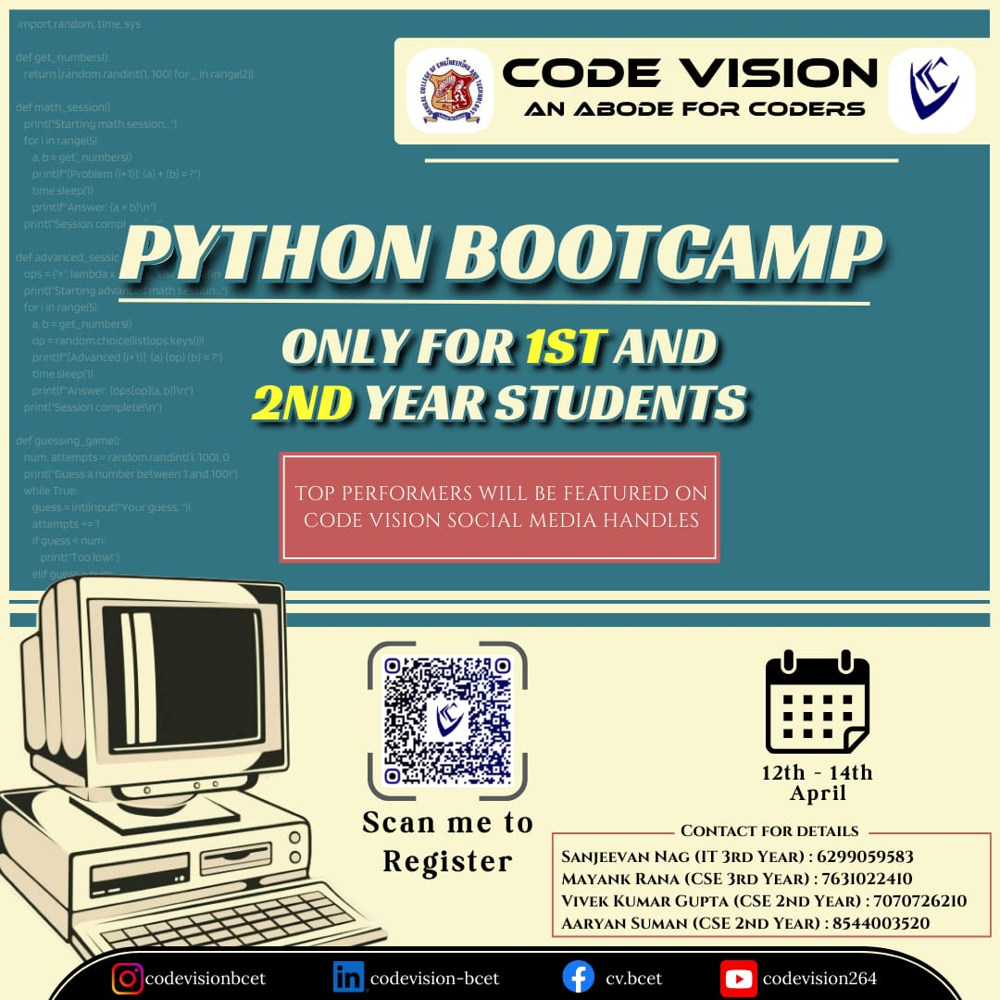

<!-- | [Home](./README.md) | [About Us](AboutUs.md) | [Events](Events.md) | [Members](Members.md) | [Alumni](Alumni.md) | [Gallery](Gallery.md) | [Contact Us](ContactUs.md) |
|------------------------|------------------------|---------------------|-----------------------|---------------------|-----------------------|----------------------------| -->

  
  
  
  
  
  

# 
🌐Events
 
 
Explore our technical events and activities
 

## 🧭 Navigation Bar
- [Python Bootcamp](#-python-bootcamp)
- [C Workshop](#-c-workshop)
- [CodeJam](#-codejam)
- [Recruitment](#-recruitment)
- [Console](#-console)

---

# 🚀 Python Bootcamp

| 🖼️ Poster | 📄 Event Details |
|-----------|------------------|
|   📌 *Scan the QR code in the poster to register!* | **Introduce Python programming basics through hands-on coding.**    **Organized by:** Code Vision - An Abode for Coders    ### 🎯 Target Audience   - First and second year students    ### ⏳ Duration   - **3 Days** (12th - 14th April)    ### 📚 Agenda   - **Introduction**: Overview of Python and its applications   - **Basic Data Types**: Numbers, strings, and variables   - **Functions**: Defining and using functions in Python   - **Control Flow**: If-else statements, loops, and logical operators   - **Data Structures**: Lists, tuples, dictionaries, and sets   - **OOPs**: Object-Oriented Programming concepts in Python   - **Project**: Build a mini Python application to apply the concepts learned   - **Hands-on Exercises**: Practical coding tasks for each topic   - **Q&A & Peer Collaboration**: Address questions, troubleshoot, and collaborate   - **Wrap-Up & Feedback**: Recap, gather feedback, and share resources    ### 🌟 Extras   - Support team for assistance   - Handouts and resource links   - Continued learning via a follow-up Q&A and networking   - **Top performers will be featured on Code Vision social media handles**    ### 📌 Event Details   - **Date**: 12th - 14th April   - **Mode**: Offline   - **Organizer**: Code Vision (An Abode for Coders)    ### 📲 Registration   - Scan the QR code from the poster to register.    ### 🔗 Connect with Us   - [Instagram](https://instagram.com/codevisionbcet)   - [LinkedIn](https://linkedin.com/company/codevision-bcet)   - [GitHub](https://github.com/codevision-bcet) |

---

💡 *Learn Python from scratch, build real projects, and collaborate with peers to strengthen your coding journey!*

## 📚 Explore More
- [Home](../README.md)  
- [About Us](../pages/ABOUT.md)  
- [Events](../pages/EVENTS.md)  
- [Members](../pages/MEMBERS.md)  
- [Alumni](../pages/ALUMNI.md)  
- [Gallery](../pages/GALLERY.md)   

---

## 📬 Contact Us
📧 Email: [codevisionafc@gmail.com](mailto:codevisionafc@gmail.com)  
📞 Phone: +91 6299059583 (SCO)  

🏛️ Address:  
1st floor, Dept. of CSE, Computer Science and Engineering Block,  
Bengal College of Engineering and Technology, Durgapur, West Bengal - 713212  

---

## 🌐 Follow Us

[Website]( https://codevision-bcet.web.app/) |[GitHub](https://github.com/Code-Vision-BCET-organisation ) | [LinkedIn](https://www.linkedin.com/company/codevision-bcet) | [Instagram](https://www.instagram.com/codevisionbcet/) | [Facebook](https://www.facebook.com/cv.bcet/) | [YouTube](http://www.youtube.com/@codevisionbcet )  

---

© 2025 **Code Vision**. All Rights Reserved.  

