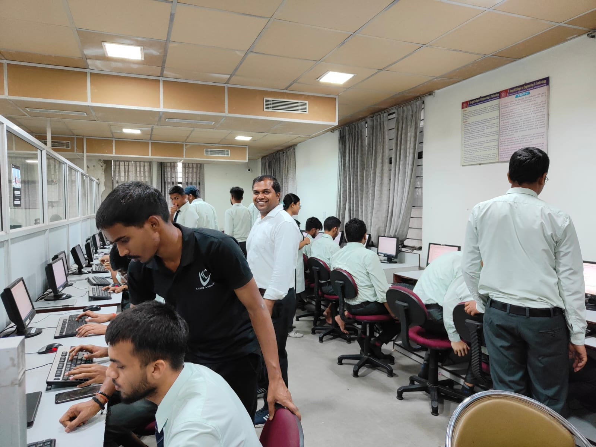
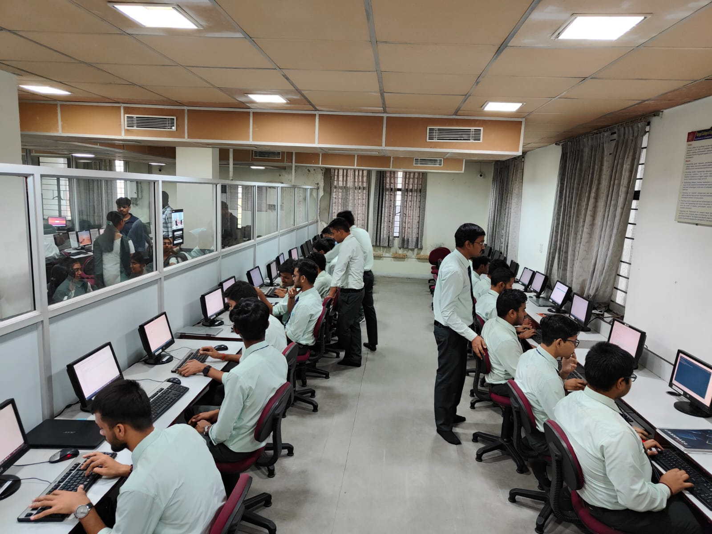
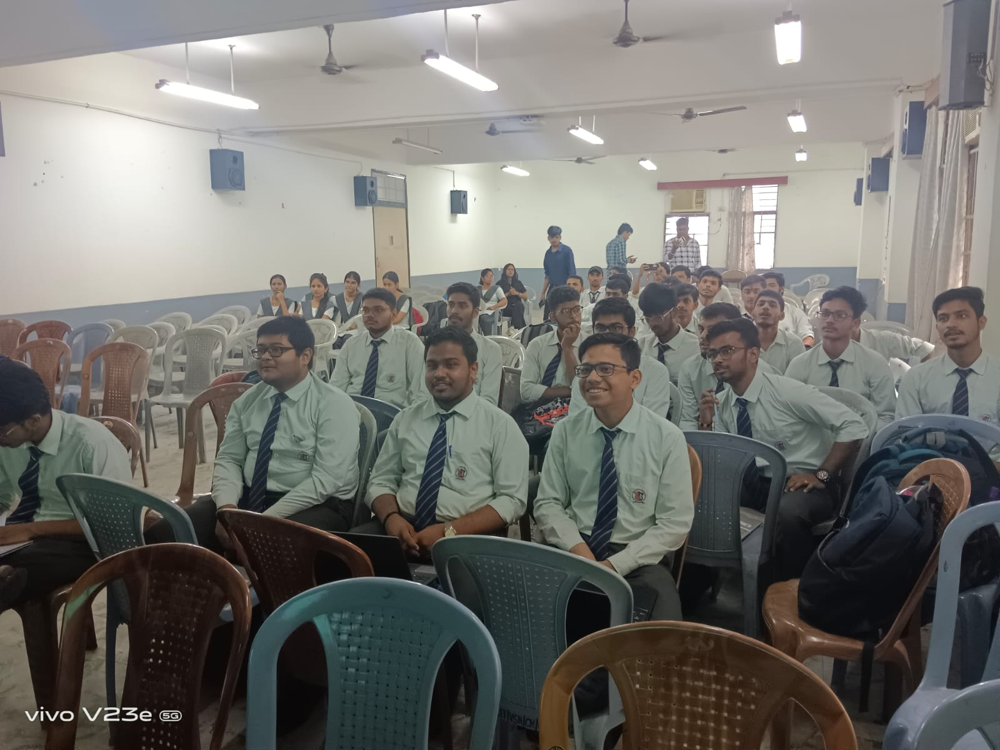
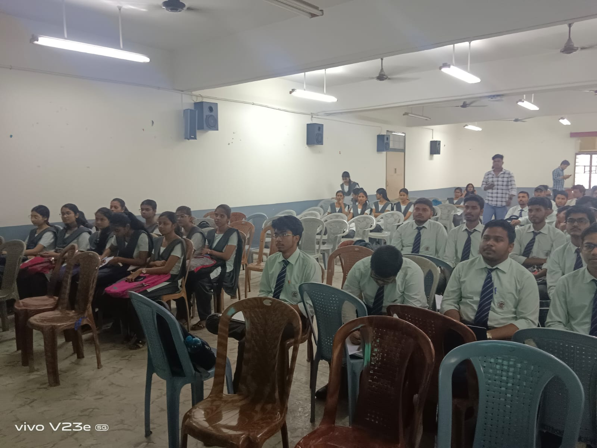
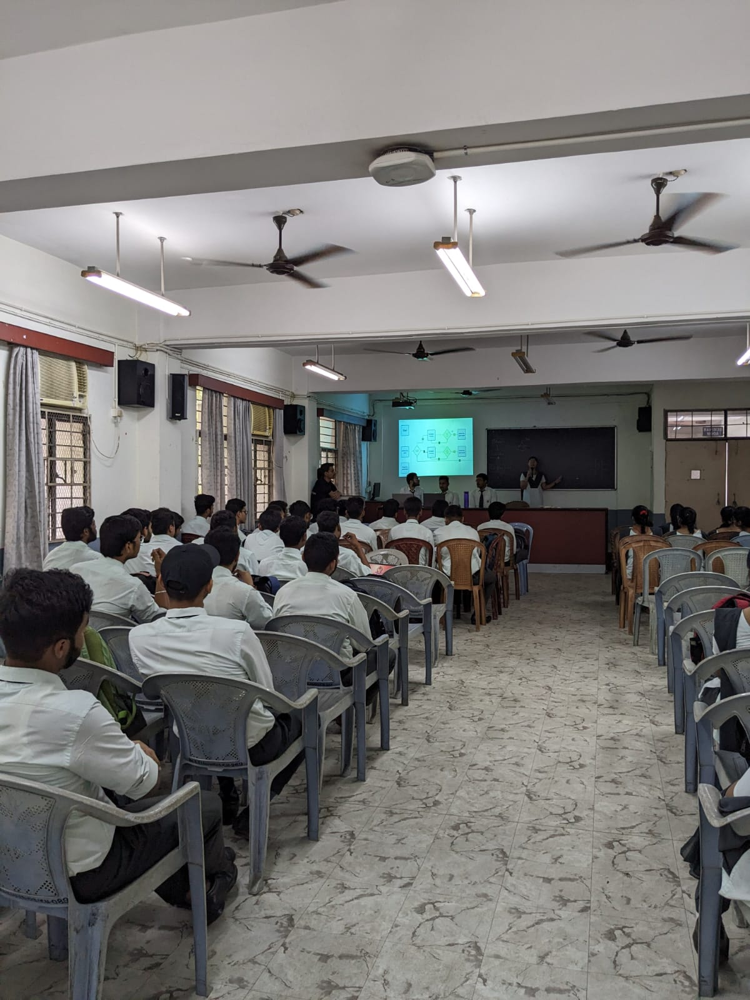
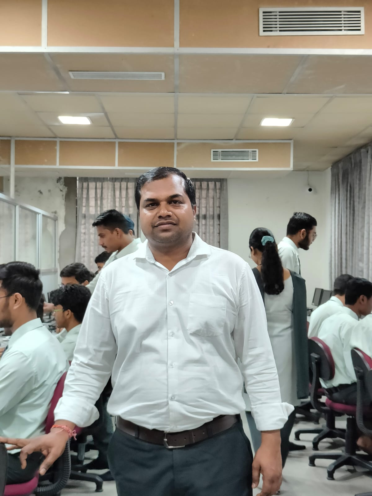
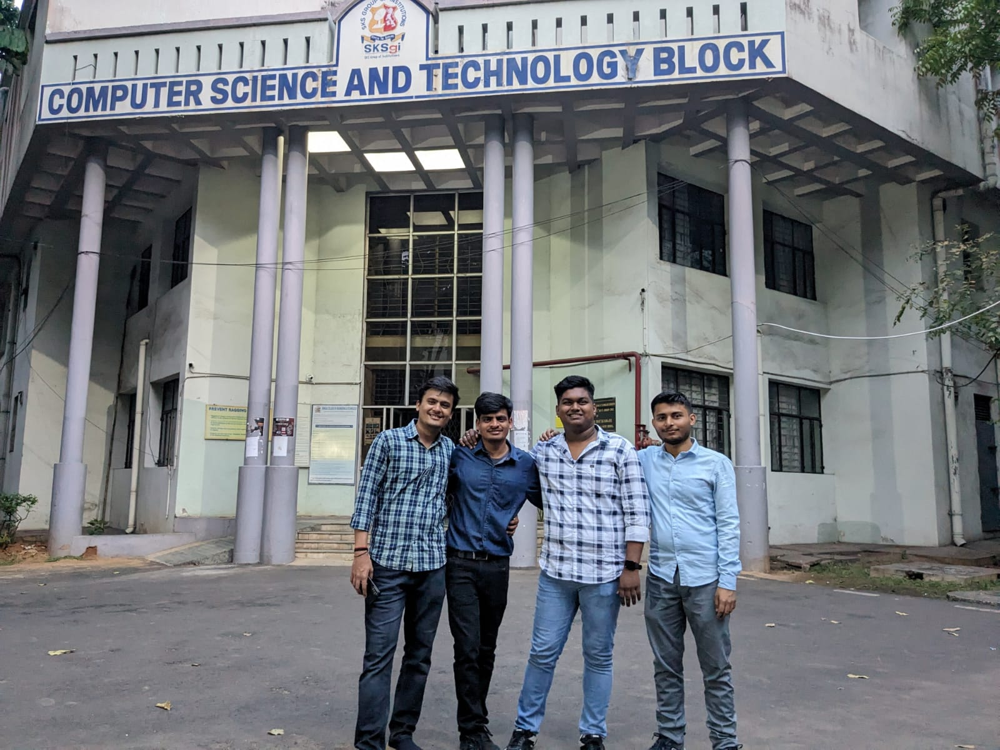

<!-- | [Home](./README.md) | [About Us](AboutUs.md) | [Events](Events.md) | [Members](Members.md) | [Alumni](Alumni.md) | [Gallery](Gallery.md) | [Contact Us](ContactUs.md) |
|------------------------|------------------------|---------------------|-----------------------|---------------------|-----------------------|----------------------------| -->

  
  
  
  
  
  

# 
📸 Gallery 

 
Memories from our events
 

---

## 🎯 C-Workshop  
<table align="center">
  <tr>
    <td></td>
    <td></td>
    <td></td>
    <td></td>
    <td></td>
  </tr>
  <tr>
    <td></td>
    <td></td>
    <td></td>
    <td></td>
    <td></td>
  </tr>
  <tr>
    <td></td>
    <td></td>
    <td></td>
    <td></td>
    <td></td>
  </tr>
  <tr>
    <td></td>
    <td></td>
    <td></td>
  </tr>
</table>

---

## 🎮 Console  
<table align="center">
  <tr>
    <td></td>
    <td></td>
    <td></td>
    <td></td>
    <td></td>
  </tr>
  <tr>
    <td></td>
    <td></td>
    <td></td>
    <td></td>
    <td></td>
  </tr>
  <tr>
    <td></td>
    <td></td>
    <td></td>
    <td></td>
    <td></td>
  </tr>
  <tr>
    <td></td>
    <td></td>
  </tr>
</table>

---

## 💻 Code Jam  
<table align="center">
  <tr>
    <td></td>
    <td></td>
    <td></td>
    <td></td>
    <td></td>
  </tr>
  <tr>
    <td></td>
    <td></td>
    <td></td>
    <td></td>
    <td></td>
  </tr>
  <tr>
    <td></td>
    <td></td>
    <td></td>
    <td></td>
    <td></td>
  </tr>
  <tr>
    <td></td>
    <td></td>
    <td></td>
    <td></td>
  </tr>
</table>

---

## 🎓 Farewell  
<table align="center">
  <tr>
    <td></td>
    <td></td>
    <td></td>
    <td></td>
    <td></td>
  </tr>
  <tr>
    <td></td>
    <td></td>
    <td></td>
    <td></td>
    <td></td>
  </tr>
  <tr>
    <td></td>
    <td></td>
    <td></td>
    <td></td>
  </tr>
</table>

## 📚 Explore More
- [Home](../README.md)  
- [About Us](../pages/ABOUT.md)  
- [Events](../pages/EVENTS.md)  
- [Members](../pages/MEMBERS.md)  
- [Alumni](../pages/ALUMNI.md)  
- [Gallery](../pages/GALLERY.md)    

---

## 📬 Contact Us
📧 Email: [codevisionafc@gmail.com](mailto:codevisionafc@gmail.com)  
📞 Phone: +91 6299059583 (SCO)  

🏛️ Address:  
1st floor, Dept. of CSE, Computer Science and Engineering Block,  
Bengal College of Engineering and Technology, Durgapur, West Bengal - 713212  

---

## 🌐 Follow Us

[Website]( https://codevision-bcet.web.app/) |[GitHub](https://github.com/Code-Vision-BCET-organisation ) | [LinkedIn](https://www.linkedin.com/company/codevision-bcet) | [Instagram](https://www.instagram.com/codevisionbcet/) | [Facebook](https://www.facebook.com/cv.bcet/) | [YouTube](http://www.youtube.com/@codevisionbcet )  

---

© 2025 **Code Vision**. All Rights Reserved.  

